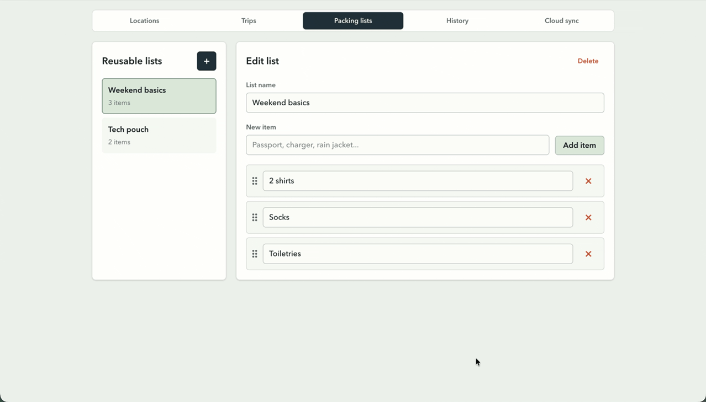
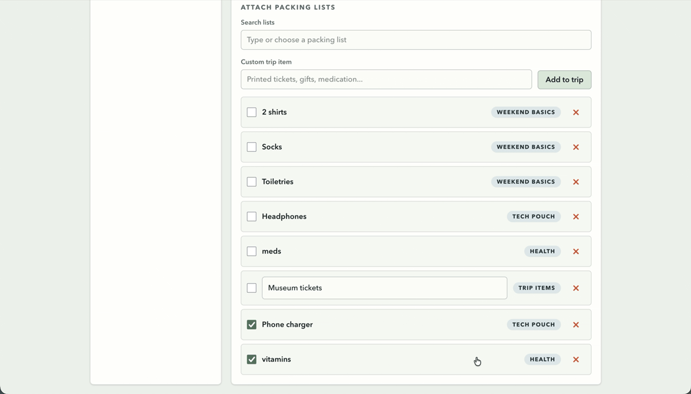
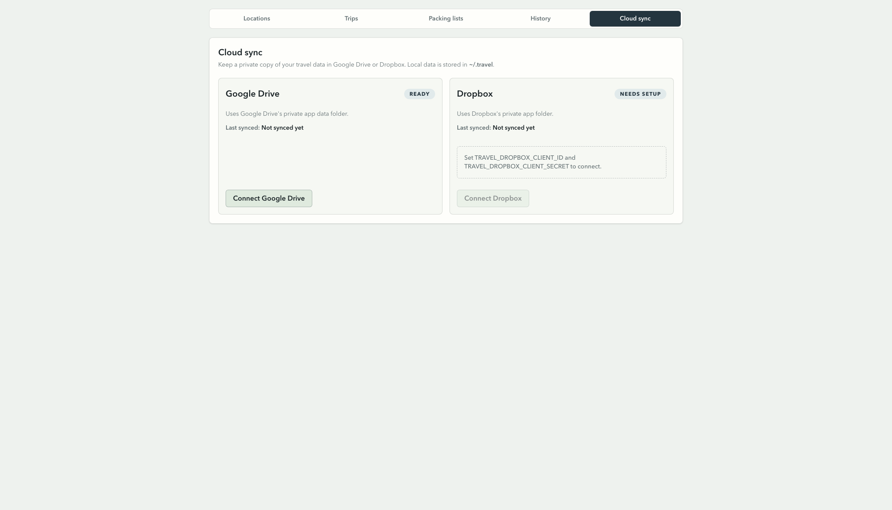

# Travel Plans

A local-first travel planning app built with Vite, React, TypeScript, and
Tailwind CSS. It helps track upcoming and past trips, reusable destination
details, travel routes, trip checklists, packing lists, and optional private
cloud sync.

## Requirements

- Node.js 20 or newer
- npm

Install dependencies:

```sh
npm install
```

## Run locally

Start the development server:

```sh
npm run dev
```

The app runs on `http://127.0.0.1:5173` by default. The Vite server includes a
local API for reading and writing the travel data file.

To try the app with sample data:

```sh
npm run dev:demo
```

The demo server runs on port `5174` and seeds `.travel-demo/travel-data.json`.
You can also seed the demo data without starting Vite:

```sh
npm run demo:seed
```

## Features

- Manage upcoming trips and automatically separate past trips into History.

  
- Store reusable locations with notes and saved travel routes.

  
- Add trip-specific stay details, notes, travel routes, and checklists.

  
- Build reusable packing lists and attach them to trips.

  
- Add trip-only packing items, mark items packed, and hide individual list
  items from a trip.

  
- Preserve packed trip snapshots when packing lists change.
- Optional Google Drive or Dropbox sync using each provider's private app
  storage.

  

## Data storage

By default, app data is stored locally at:

```text
~/.travel/travel-data.json
```

Set `TRAVEL_DATA_DIR` to store data somewhere else:

```sh
TRAVEL_DATA_DIR=/path/to/travel-data npm run dev
```

Cloud sync connection state is stored in the same data directory. Local API
requests are only accepted from localhost unless `TRAVEL_PUBLIC_ORIGIN` is set.

## Cloud sync

Cloud sync is optional. Configure one or both providers before using the Cloud
sync tab:

```sh
TRAVEL_GOOGLE_DRIVE_CLIENT_ID=...
TRAVEL_GOOGLE_DRIVE_CLIENT_SECRET=...
TRAVEL_DROPBOX_CLIENT_ID=...
TRAVEL_DROPBOX_CLIENT_SECRET=...
```

When running behind a public callback URL, set:

```sh
TRAVEL_PUBLIC_ORIGIN=https://your-public-origin.example
```

Google Drive sync uses the Drive app data scope. Dropbox sync uses the app
folder with read, write, and metadata scopes.

## Scripts

- `npm run dev` starts the local Vite server.
- `npm run dev:demo` starts a demo server with sample travel data on port `5174`.
- `npm run demo:seed` writes demo data to `.travel-demo/travel-data.json`.
- `npm run build` type-checks and builds the app.
- `npm run test:run` runs the Vitest suite once.
- `npm run test` runs Vitest in watch mode.
- `npm run preview` serves the production build.
- `npm run storybook` opens Storybook with populated and empty app states.
- `npm run build-storybook` builds the Storybook static site.

## Test

Run the test suite once:

```sh
npm run test:run
```

Build the production bundle:

```sh
npm run build
```

## Docker

Build and run the production preview server:

```sh
docker build -t travel-plans .
docker run --rm -p 4173:4173 travel-plans
```

The container stores data in `/data/travel`. Mount a volume if you want to keep
that data between runs:

```sh
docker run --rm -p 4173:4173 -v travel-data:/data/travel travel-plans
```
